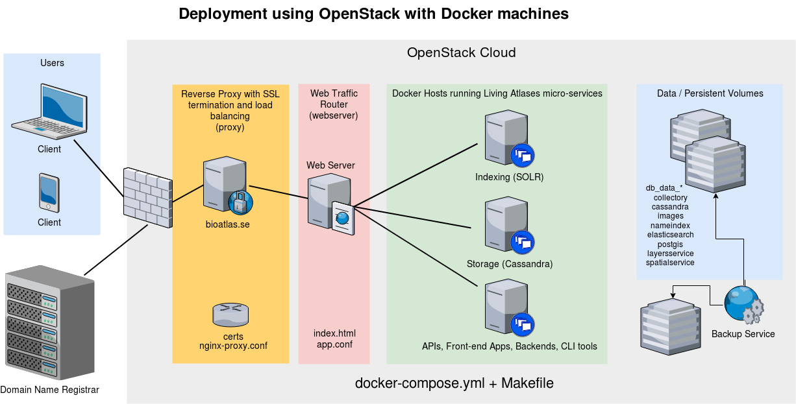

# Production deployment of ala-docker

The `ala-docker` repository holds a dockerized service composition with Living Atlases software. This system has been deployed on an OpenStack-based cloud and is available at https://bioatlas.se. 

Here is an overview of this system:

Some more details on the production deployment is available [here](https://github.com/AtlasOfLivingAustralia/documentation/wiki/BioAtlas-Sweden-production-environment)

The system components including relevant versioned images etc are defined in the `docker-compose.yml`(https://github.com/bioatlas/ala-docker/blob/master/docker-compose.yml) file.

The commands to manage the system are listed in the `Makefile`(https://github.com/bioatlas/ala-docker/blob/master/Makefile).

This rest of this intro will now describe how to deploy the same system on an OpenStack-based production server.

# Setting up a server using an OpenStack-based cloud

We start from scratch by provisioning the servers in the Open Stack-based cloud, such as the SUNET Compute Cloud (SafeSpring - see https://safespring.com for details about this IaaS provider). Docs from SafeSpring on how to get started are available [here](https://docs.safespring.com/compute/getting-started/). 

## CLI for Open Stack

IaaS cloud providers like Amazon Elastic Cloud, Digital Ocean and others often have command line tools that can help to automate setup of hosts. 

Let's assume that you plan to use a laptop to connect to the OpenStack-based cloud and to deploy the system.  You can then use the "openstackclient" command that can be installed and run from the CLI. First install the python openstackclient:

    apt install python-openstackclient

You can now set up environment variables that allows you to connect and use automate the deployment from the CLI of this laptop. A set of environment variables can be defined in a "run codes file" or "rc-file". Such a file with the necessary environment variables can be downloaded from the Open Stack UI. 

It becomes accessible after logging in to the OpenStack cloud's web-based portal at a location like this one:  <https://dashboard.cloud.sunet.se/project/access_and_security/api_access/openrc/>

Download the "rc-file" that you get from the openstack portal to the laptop and then source it like this:

    source ~/Downloads/bas-infra1.nrm.se-openrc.sh

## Manage Open Stack resources from the CLI

You can now have the CLI tool and the environment variables set up. You can therefore now issue commands from the command line, such as:

    openstack network list
    openstack flavor list
    openstack ip floating pool list
    openstack image list
    openstack security group list

In other words, you can now remotely manage the Open Stack cloud resources from the command line on your laptop.

## Use "docker-machine"

You can now install Docker Machine and use it to provision a host. First get `docker-machine` from https://github.com/docker/machine/releases. 

Provision a host with a command that looks like this one :

    docker-machine --debug create \
      --openstack-auth-url "https://keystone.api.cloud.ipnett.se/v3" \
      --openstack-tenant-id "4168b2afdf0f40949b340c7d9db0813a" \
      --openstack-sec-groups "bioatlas-default" \
      --openstack-domain-name "nrm.se" \
      --openstack-net-name "bioatlas-network" \
      --openstack-floatingip-pool "public-v4" \
      --openstack-ssh-user "ubuntu" \
      --openstack-image-name "ubuntu-18.04 [20180517]" \
      --openstack-flavor-name "b.large" \
      -d "openstack" test-host

Note that `docker-machine` uses dotfiles in ~/.docker.

Make sure to use your own settings for example with regards to the relevant "flavor" - which is a kind of preset config for the host's size - where you can enumerate available valid values with the command `openstack flavor list`)

If you are setting up a swarm of several docker hosts that you plan on managing from outside the cloud, you need to make sure that the OpenStack cloud permits traffic from the docker daemon by adding TCP 2377 and TCP 2376 to your default security group, say "bioatlas-default". Port 2376 is the Docker daemon port. Port 2377 is the swarm management port.

To upgrade and login to a shell on the provisioned box above, then use....

    docker-machine upgrade test-host
    docker-machine ssh test-host

If you have followed the instructions above, you are now logged in to the newly provisioned host and it has an up-to-date docker daemon installed.

## Production deployment

We now need to make more configurations. We need to treat the production environment differently from a laptop-based development server.

For example, we need to have a firewall, set up DNS, SSL, review credentials used and set up backup/restore.

### Activate firewall and allow ssh and web traffic

    sudo ufw allow OpenSSH
    sudo ufw allow http
    sudo ufw allow https
    sudo ufw enable
    sudo ufw status

### Enable automatic security patching

The `unattended-upgrades' package is installed by default in Ubuntu 18.04 and can be non-interactively activated with this command:

    # interactive way to activate unattended security patching:
    # sudo dpkg-reconfigure unattended-upgrades
    
    sudo cp /usr/share/unattended-upgrades/20auto-upgrades /etc/apt/apt.conf.d/20auto-upgrades
    
    # inspect logs in /var/log/unattended-upgrades
    more /var/log/unattended-upgrades/unattended-upgrades.log

### Set up DNS

The `dnsmasq` component used on a development server doesn't need to run in production. Instead, to set up DNS, go to your registrar such as Loopia or equiv and add a subdomain such as "test.infrabas.se" with a DNS A entry pointing to the public ip that you get from the `docker-machine ip test-host` command.

### Set up SSL

An TLS/SSL cert needs to be present in the production environment, for being able to use https. The `docker-compose.yml` file therefore needs a bind mount for the proxy component and the certs need to be present in the host's `certs` directory.

Then uncomment this line in the `docker-compose.yml` file in the section for the nginx proxy:

    - ./certs:/etc/nginx/certs:ro

### Install `docker-compose` 

In order to be able to deploy a docker-compose.yml file, make sure you have `docker-compose`:

    sudo apt install python-pip
    sudo pip install docker-compose    

Also make sure you can run docker and docker-compose [without having to use  sudo](https://stackoverflow.com/questions/21871479/docker-cant-connect-to-docker-daemon/33596140#33596140):

    sudo groupadd docker
    sudo usermod -aG docker $(whoami)
    sudo service docker start

### Get the code with the system composition

Then do this to get the code that defines the system composition onto the server:

    mkdir repos
    cd repos
    git clone https://github.com/bioatlas/ala-docker.git
    cd ala-docker/
    mkdir certs

From your laptop, move relevant certs to the host:

    docker-machine scp -r certs test-host:repos/ala-docker

Start the system using steps described [here](../):

Starting the system for the first time takes considerable time, several minutes.

## Backup and restore

On the host, add a crontab entry to schedule automated backups:

    45 4 * * * bash -c 'cd /home/ubuntu/repos/ala-docker && make backup'
    
Also verify that the Makefile restore target works.

